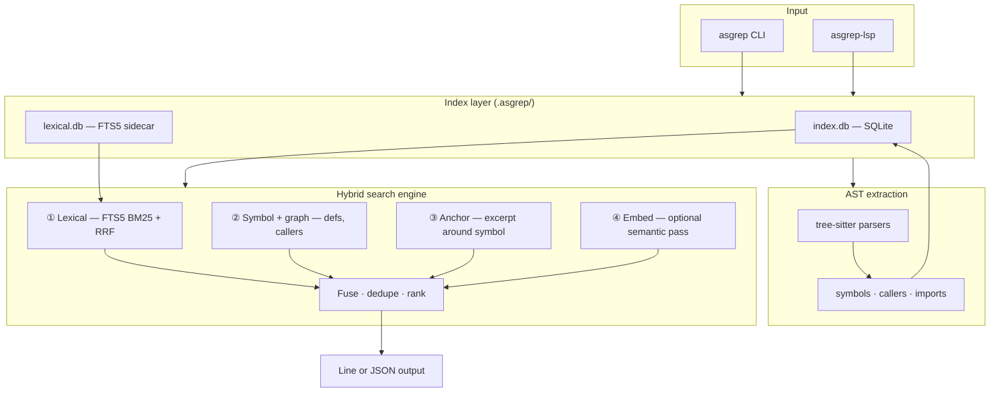
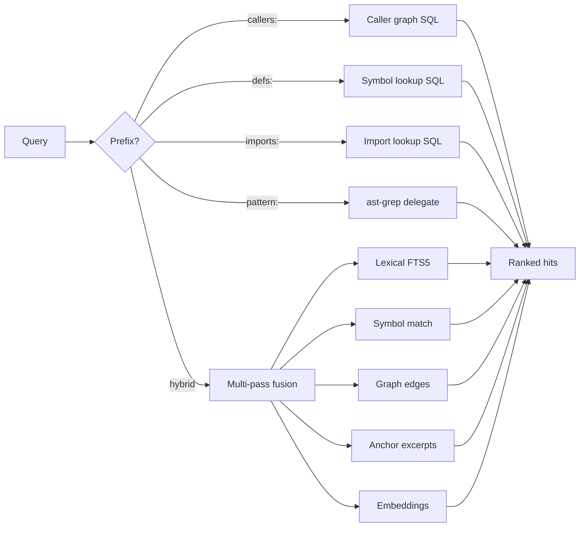

# ast-sgrep

**Polyglot hybrid code search** — find intent across **8 languages** (Rust, TypeScript, JavaScript, Python, Go, Java, C#, Ruby) with lexical search, AST symbol graphs, and optional semantic embeddings.

```bash
cargo install ast-sgrep-cli
asgrep index .
asgrep "where is auth refreshed"
```

> **ast-grep finds shapes. ast-sgrep finds intent with graph context.**

---

## Why ast-sgrep?

Code search tools solve different problems. **ast-sgrep takes a different approach** from both [ast-grep](https://github.com/ast-grep/ast-grep) and [ripgrep](https://github.com/BurntSushi/ripgrep): it builds a persistent, queryable index that fuses text search with AST-derived symbol and call-graph context — so you can ask *“where is auth refreshed?”* and get definitions, callers, and anchor excerpts in one ranked result set.

### How the tools compare

| | **ast-sgrep** | **ast-grep** | **ripgrep** |
|---|:---:|:---:|:---:|
| **Primary goal** | Navigate & understand codebases | Structural search & codemods | Fast text search |
| **Search model** | Persistent SQLite index + hybrid ranking | Pattern match per run | Streaming regex scan |
| **Natural-language queries** | Yes (`"how does auth refresh work"`) | No | No |
| **Symbol definitions** | Yes (`defs:process_request`) | Via pattern only | No |
| **Caller / callee graph** | Yes (`callers:main`) | No | No |
| **Import tracking** | Yes (`imports:serde`) | No | No |
| **Structural patterns** | Yes (`pattern:fn $NAME($$$)`) — delegates to ast-grep | Native | No |
| **Semantic similarity** | Optional (`--embed`, `--cloud-embed`) | No | No |
| **Polyglot (8 languages)** | Yes, unified index | Yes | Yes (text only) |
| **CI / API JSON plugins** | GitHub & GitLab (`--format`) | No | No |
| **LSP integration** | `asgrep-lsp` (symbols, defs, refs, call hierarchy) | Separate ecosystem | No |
| **JSON output for agents** | Yes (`--json`) | Yes | Yes (`--json`) |
| **Typical latency** | ~0.3 ms/search (indexed) | Pattern-dependent | ~ms–s per scan |

### When to use which

| You want to… | Reach for |
|---|---|
| Ask *“where does X happen?”* across a whole repo | **ast-sgrep** |
| Find who calls a function or where a symbol is defined | **ast-sgrep** |
| Feed ranked, structured hits to an AI agent | **ast-sgrep** (`--json`) |
| Rewrite code with AST-aware rules | **ast-grep** |
| Match a syntactic shape (`class $C { $$$ }`) | **ast-grep** or `asgrep "pattern:…"` |
| Grep logs, configs, or any file type fast | **ripgrep** |
| One-off regex across unindexed files | **ripgrep** |

ast-sgrep **complements** ast-grep and ripgrep — it does not replace them. Use `pattern:` to delegate structural queries to ast-grep when installed; use ripgrep when you need raw speed over files ast-sgrep does not index.

---

## Architecture



### Search pipeline



---

## Benchmarks

Measured on the polyglot sample fixture (5 files, 25 symbols, 26 caller edges) with `cargo build --release`:

| Metric | Result | Target |
|--------|--------|--------|
| Index 5 files | **0.19 ms** | — |
| Avg hybrid search (`process_request`, 100 iter) | **0.29 ms** | < 20 ms |
| False-positive caller rate (regression suite) | **0%** | 0% |
| Test suite | **62 tests** | all passing |

```bash
asgrep bench . --iterations 100
# Benchmark (v1.0 targets: search <20ms, 0% false callers)
# Indexed 5 files in 0.19ms
# Query: process_request
# Avg search: 0.29ms over 100 iterations (16 hits)
```

---

## Install

```bash
# CLI
cargo install ast-sgrep-cli

# LSP server (editor integration)
cargo install ast-sgrep-lsp
```

Binaries: `asgrep` and `ast-sgrep` (aliases).

---

## Quick start

```bash
# Build index (stored in .asgrep/index.db)
asgrep index .

# Natural-language / keyword search
asgrep "auth refresh"
asgrep "how does process_request work"

# Prefixed graph queries
asgrep "callers:process_request"    # who calls process_request?
asgrep "defs:auth_refresh"          # where is auth_refresh defined?
asgrep "imports:serde"              # import statements mentioning serde
asgrep "pattern:fn $NAME($$$)"      # structural — delegates to ast-grep

# Semantic search (index with --embed first)
asgrep --embed index .
asgrep --embed "auth refresh"

# Large monorepos: lexical FTS sidecar (auto at 1000+ files)
asgrep --tantivy index .

# JSON for agents / automation
asgrep --json --limit 32 "process_request"

# GitHub / GitLab code-search shaped JSON
asgrep --json --format github "auth refresh"
asgrep --json --format gitlab "process_request"

# Index management
asgrep status .
asgrep reindex .          # force full re-parse (bypasses hash skip)
asgrep bench .
```

---

## CLI reference

### Commands

| Command | Description |
|---------|-------------|
| `asgrep index [ROOT]` | Build or incrementally update the index |
| `asgrep reindex [ROOT]` | Force full reindex (re-parse every file) |
| `asgrep status [ROOT]` | Show index statistics |
| `asgrep bench [ROOT]` | Run search latency benchmarks |
| `asgrep "QUERY" [ROOT]` | Hybrid search (default) |

### Flags

| Flag | Description |
|------|-------------|
| `--root` | Project root (default: `.`) |
| `--limit` | Max results (default: 16, env: `ASGREP_LIMIT`) |
| `--json` | JSON output |
| `--format` | JSON shape: `native`, `github`, `gitlab` |
| `--index-path` | Custom index DB path (`ASGREP_INDEX_PATH`) |
| `--lang` | Filter by language (`rust`, `typescript`, `javascript`, `python`, `go`) |
| `--embed` | Enable embeddings at index + search time (`ASGREP_EMBED=1`) |
| `--tantivy` | Build/use lexical FTS sidecar (`ASGREP_TANTIVY=1`) |
| `--cloud-embed` | Cloud query embeddings (`ASGREP_CLOUD_EMBED=1`, needs API key) |
| `ASGREP_USE_CACHE=1` | Store index in `~/.cache/asgrep/` |

### Output kinds

| Kind | Meaning |
|------|---------|
| `ASGREP` | Lexical line hit (FTS5) |
| `DEF` | Symbol definition |
| `CALLER` | Caller → callee edge |
| `GRAPH` | Graph neighborhood summary |
| `ANCHOR` | Excerpt around a matched symbol |
| `IMPORT` | Import statement |
| `PATTERN` | Structural match via ast-grep |
| `EMBED` | Semantic similarity hit |

### Example output

```
DEF: src/main.rs: auth_refresh span=19..22 | fn auth_refresh() { ... }
CALLER: src/main.rs: main -> auth_refresh
GRAPH: src/main.rs: main calls auth_refresh
ANCHOR: src/main.rs:19-22: fn auth_refresh() { ... }
```

### JSON example

```json
{
  "query": "how does process_request work",
  "limit": 16,
  "hits": [{
    "kind": "anchor",
    "file": "src/main.rs",
    "line_start": 6,
    "line_end": 12,
    "symbol": "process_request",
    "language": "rust",
    "score": 6.0,
    "excerpt": "fn process_request(...) { ... }"
  }]
}
```

---

## LSP server

Full Phase 6 implementation — `asgrep-lsp` over stdio with Content-Length framed JSON-RPC.

```bash
cargo install ast-sgrep-lsp
```

| LSP method | Feature |
|------------|---------|
| `workspace/symbol` | Hybrid search across workspace |
| `textDocument/documentSymbol` | AST symbols per file |
| `textDocument/definition` | Go-to-definition at cursor |
| `textDocument/references` | Find references + callers |
| `callHierarchy/*` | Incoming/outgoing call graph |
| `workspace/executeCommand` | `asgrep.search`, `asgrep.reindex`, `asgrep.callers`, `asgrep.defs` |
| `textDocument/didSave` | Incremental single-file reindex |

See [docs/lsp.md](docs/lsp.md) for editor configuration.

---

## Crate layout

```
ast-sgrep/
├── crates/ast-sgrep-core/    # Index + hybrid search engine
├── crates/ast-sgrep-cli/     # asgrep / ast-sgrep binaries
├── crates/ast-sgrep-lang/    # tree-sitter parsers (Rust, TS, JS, Python, Go)
├── crates/ast-sgrep-embed/   # Local + cloud embedding plugins
├── crates/ast-sgrep-plugins/ # GitHub / GitLab JSON output adapters
├── crates/ast-sgrep-lsp/     # LSP server (asgrep-lsp)
├── tests/fixtures/           # Polyglot sample + regression fixtures
└── docs/                     # LSP, publishing, architecture notes
```

### Index schema (`.asgrep/index.db`)

| Table | Contents |
|-------|----------|
| `files` | Path, language, content hash, mtime |
| `lines` | Per-line text content |
| `lines_fts` | FTS5 virtual table for lexical search |
| `symbols` | Function/method/type definitions |
| `callers` | Caller → callee edges (AST-derived, string/comment-safe) |
| `imports` | Import/module paths |
| `embeddings` | Optional per-line vectors (`--embed`) |

Incremental indexing uses blake3 content hashes + mtime. Respects `.gitignore` and `.asgrepignore`.

---

## Library usage

```rust
use ast_sgrep_core::{IndexOptions, Indexer, SearchOptions, Searcher};

let mut indexer = Indexer::new(IndexOptions {
    root: ".".into(),
    index_path: None,
    lang_filter: None,
    respect_gitignore: true,
    use_tantivy: false,
    embed_lines: false,
    embed_backend: ast_sgrep_core::EmbedBackend::Local,
    force_reindex: false,
})?;
indexer.index_all()?;

let searcher = Searcher::new(SearchOptions {
    root: ".".into(),
    index_path: None,
    limit: 16,
    lang_filter: None,
    use_embed: false,
    use_tantivy: false,
    use_cloud_embed: false,
})?;
let response = searcher.search("auth refresh")?;
```

---

## Roadmap

All phases complete (v1.0). See [PRD.md](PRD.md) for the full specification.

| Phase | Scope | Status |
|-------|-------|--------|
| 0 | Repo + Cargo workspace | Done |
| 1 | Rust+TS, SQLite, CLI, JSON | Done |
| 2 | Python+Go, incremental, benchmarks | Done |
| 3 | False-positive tests, crates.io metadata | Done |
| 4 | `pattern:` ast-grep delegation | Done |
| 5 | Local + cloud embedding plugins | Done |
| 6 | Full LSP server | Done |

Publishing: `scripts/publish.sh` (manual, no CI). See [docs/publishing.md](docs/publishing.md).

---

## License

MIT — see [LICENSE](LICENSE).
