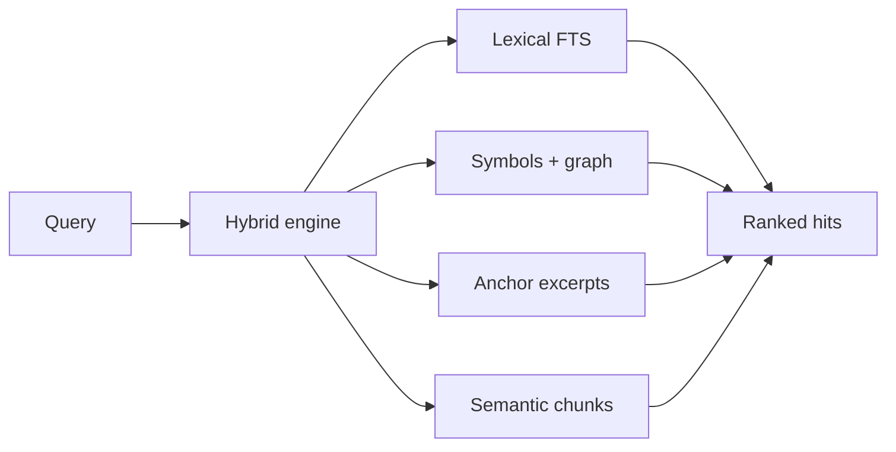

# ast-sgrep

**Hybrid code search that understands intent** — not just text or syntax.

**v1.0.0-alpha.0** · 8 languages · lexical + AST graph + **semantic symbol search** (on by default, no API key)

```bash
cargo install ast-sgrep-cli
asgrep index .
asgrep "where is auth refreshed"
# → defs, callers, excerpts, and semantic hits in one ranked result set
```

> **ast-grep finds shapes. ripgrep finds strings. ast-sgrep finds intent.**

---

## Why this exists

Most code search is either **fast text** (ripgrep) or **pattern matching** (ast-grep). Neither answers questions like *“where does credential renewal happen?”* or *“who calls this before the token is stored?”* — especially when the words in your question do not appear in the code.

**ast-sgrep** builds a **persistent index** of your repo: symbols, caller/callee edges, imports, lexical FTS, and **symbol-level semantic vectors** enriched with call-graph context. You query in natural language or with graph prefixes; it returns ranked hits with excerpts — ready for humans or AI agents.

**No API key required.** Offline semantic search works out of the box. Cloud and Ollama embeddings are optional upgrades.

| You need… | ast-sgrep gives you… |
|-----------|----------------------|
| *“Where is X defined?”* | `defs:` + ranked hybrid hits |
| *“Who calls this?”* | `callers:` + call hierarchy (LSP) |
| *“How does auth refresh work?”* | NL query → symbols + anchors + semantic similarity |
| *“credential renewal”* (no token overlap) | Semantic hit on `auth_refresh` |
| Structured JSON for an agent | `--json --format agent` with follow-up query hints |
| Structural rewrite / codemod | `pattern:` delegates to ast-grep |

[Full comparison with ast-grep and ripgrep →](docs/comparison.md)

---

## Where it fits in your stack

ast-sgrep **complements** ripgrep and ast-grep — it does not replace them.

| Tool | Role |
|------|------|
| **[ripgrep](https://github.com/BurntSushi/ripgrep)** | Fast scan of logs, configs, any file — no index |
| **[ast-grep](https://github.com/ast-grep/ast-grep)** | Structural patterns and codemods |
| **ast-sgrep** | Persistent **navigation + intent** layer: NL queries, defs/callers/graph, semantic hits, agent JSON |

Use **asgrep** when you (or an agent) need to *navigate and understand* a codebase. Use **ast-grep** for shape-based rewrites. Use **ripgrep** for raw speed over unindexed files.

---

## Quick start

```bash
asgrep index .                              # .asgrep/index.db (incremental, respects .gitignore)

asgrep "auth refresh"                       # hybrid: lexical + symbols + graph + semantic
asgrep "credential renewal"                 # synonym → auth_refresh (semantic, no shared tokens)
asgrep "callers:process_request"            # who calls process_request?
asgrep "defs:auth_refresh"                  # definition sites
asgrep "pattern:fn $NAME($$$)"              # structural — delegates to ast-grep if installed

asgrep --json --format agent "where is auth refreshed"   # agent-ready JSON
asgrep semantic "persist access token" --json              # semantic-only search

asgrep status .                             # files, symbols, embed backend, IVF sidecar
```

Optional backends and scale knobs:

```bash
asgrep --no-embed index .       # disable semantic layer
asgrep --ollama-embed index .   # local neural embeddings (Ollama)
asgrep --cloud-embed index .    # OpenAI-compatible API (ASGREP_EMBED_API_KEY)
asgrep --tantivy index .        # lexical FTS sidecar for large repos (auto at 1000+ files)
```

[Getting started guide →](docs/getting-started.md) · [How it works →](docs/how-it-works.md) · [Semantic search (the S) →](docs/semantic-search.md)

---

## What “semantic” means here

Unlike line-level hash embeddings, ast-sgrep embeds **symbol chunks** — each function/method/type with name, kind, callers, callees, and an excerpt — then expands with code-domain concept groups (auth ↔ credential ↔ token, refresh ↔ renewal, etc.).

```
Query: "credential renewal"
  → semantic pass ranks auth_refresh (zero token overlap, regression-tested)
```

Provider chain at index and search time: **Cloud** (if API key) → **Ollama** (if running) → **semantic local** (always available). Large repos (≥2k symbols) use a persisted **IVF-ANN** sidecar (`.asgrep/semantic.ivf`) so restarts do not rebuild clusters.

[Deep dive: semantic layer →](docs/semantic-search.md)

---

## At a glance



| | ast-sgrep | ast-grep | ripgrep |
|---|:---:|:---:|:---:|
| Persistent index | ✓ | — | — |
| Natural-language / synonym queries | ✓ | — | — |
| Caller / callee graph | ✓ | — | — |
| Semantic similarity (default on) | ✓ | — | — |
| Structural patterns | via `pattern:` | ✓ | — |
| Typical indexed search | ~0.3 ms | per-run | per-scan |

Polyglot: **Rust, TypeScript, JavaScript, Python, Go, Java, C#, Ruby.**

---

## Interfaces

| Interface | Install | Use case |
|-----------|---------|----------|
| **CLI** | `cargo install ast-sgrep-cli` | Terminal, scripts, CI |
| **LSP** | `cargo install ast-sgrep-lsp` | Editor symbols, defs, refs, call hierarchy |
| **Library** | `ast-sgrep-core` crate | Embed search in Rust tools |
| **JSON plugins** | `--format agent\|github\|gitlab` | LLM agents, platform-shaped output |

Binaries: `asgrep` and `ast-sgrep` (aliases).

[Use cases: agents, LSP, plugins →](docs/use-cases.md)

---

## Documentation

| Doc | Contents |
|-----|----------|
| [Getting started](docs/getting-started.md) | Install, index, queries, flags, troubleshooting |
| [How it works](docs/how-it-works.md) | Architecture, search pipeline, index schema, incremental indexing |
| [Semantic search](docs/semantic-search.md) | Symbol chunks, provider chain, IVF-ANN, tuning |
| [Comparison](docs/comparison.md) | ast-sgrep vs ast-grep vs ripgrep — when to use which |
| [Use cases](docs/use-cases.md) | AI agents, LSP setup, JSON formats, CI patterns |

---

## Project status

**v1.0.0-alpha.0** — feature-complete for alpha: hybrid search, semantic layer, LSP, agent JSON, IVF persistence. Validate locally with `cargo test --workspace` before relying on production workflows.

---

## License

MIT — see [LICENSE](LICENSE).
