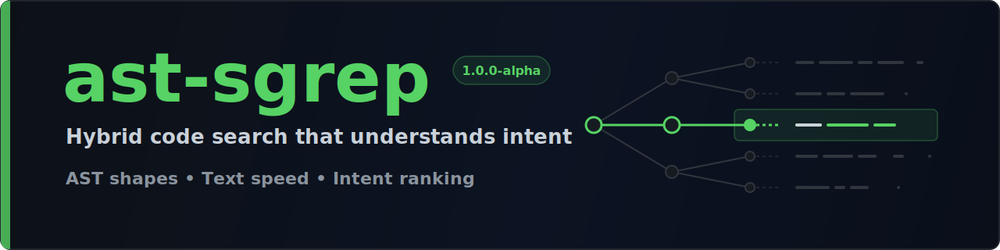

<p align="center">
  
</p>

# ast-sgrep

**Hybrid code search that understands intent** -- not only text or syntax.

**v1.1.0-alpha** · 8 languages · lexical + AST graph + **semantic symbol search** (on by default, no API key)

> **ast-grep finds shapes. ripgrep finds strings. ast-sgrep finds intent.**

---

## Install

Build from source (crates.io publish is planned):

```bash
git clone https://github.com/AdityaVG13/ast-sgrep
cd ast-sgrep
cargo build --release -p ast-sgrep-cli
./target/release/asgrep --help
```

Binaries: `asgrep` and `ast-sgrep` (aliases).

On Unix, the CLI runs commands through the process supervisor and enforces the configured
CPU duty-cycle ceiling. On Windows, commands run directly: search, indexing, cancellation,
and path handling are supported, but `ASGREP_CPU_LIMIT_PERCENT` is not enforced.

---

## Easy start (agents)

Paste into your agent:

```text
Clone https://github.com/AdityaVG13/ast-sgrep, cd into it, run `cargo build --release -p ast-sgrep-cli`.
Register target/release/asgrep-mcp as a stdio MCP server named "ast-sgrep" (build with: cargo build --release -p ast-sgrep-mcp).
Verify: run ./target/release/asgrep index . then search for defs: of a symbol in this repo.
```

---

## Why this exists

Most code search is either **fast text** (ripgrep) or **pattern matching** (ast-grep). Neither answers questions like *"where does credential renewal happen?"* when the words in your question do not appear in the code.

**ast-sgrep** builds a **persistent index**: symbols, caller/callee edges, imports, lexical FTS, and **symbol-level semantic vectors** enriched with call-graph context. Query in natural language or with graph prefixes; get ranked hits with excerpts for humans or agents.

**No API key required.** Offline semantic search works out of the box. Cloud, Ollama, and optional neural embeddings are upgrades.

| You need... | ast-sgrep gives you... |
|-------------|------------------------|
| Where is X defined? | `defs:` + ranked hybrid hits |
| Who calls this? | `callers:` + call hierarchy (LSP) |
| How does auth refresh work? | NL → symbols + anchors + semantic similarity |
| "credential renewal" (no token overlap) | Semantic hit on `auth_refresh` |
| Structured JSON for an agent | `--json --format agent` |
| Structural rewrite / codemod | `pattern:` (ast-grep when available) |

[Full comparison →](docs/comparison.md)

---

## Where it fits

ast-sgrep **complements** ripgrep and ast-grep; it does not replace them.

| Tool | Role |
|------|------|
| **[ripgrep](https://github.com/BurntSushi/ripgrep)** | Fast scan of any file. No index. |
| **[ast-grep](https://github.com/ast-grep/ast-grep)** | Structural patterns and codemods |
| **ast-sgrep** | Persistent navigation + intent: NL, defs/callers/graph, semantic hits, agent JSON |

---

## Quick start

Index is incremental and lives under the project root at `.asgrep/`.

```bash
cargo build --release -p ast-sgrep-cli
./target/release/asgrep index .
./target/release/asgrep 'defs:auth_refresh' . --limit 3
./target/release/asgrep semantic 'credential renewal' . --limit 3
./target/release/asgrep chain 'auth_refresh' . --limit 3
```

Unprefixed queries run **hybrid** retrieval. See the [query grammar](docs/QUERY_GRAMMAR.md).

[Getting started →](docs/getting-started.md) · [Architecture →](docs/ARCHITECTURE.md) · [Docs index →](docs/README.md)

---

## What "semantic" means here

ast-sgrep embeds **symbol chunks** (function/method/type with name, kind, callers, callees, excerpt), expanded with code-domain concept groups (auth ↔ credential ↔ token, refresh ↔ renewal, …).

```text
Query: "credential renewal"
  → semantic pass ranks auth_refresh (zero token overlap)
```

Provider chain: **Cloud** (if key) → **Ollama** (if configured) → **neural** (optional feature) → **local semantic** (always available). Large repos may use a persisted IVF-ANN sidecar (`.asgrep/semantic.ivf`).

[Semantic layer →](docs/semantic-search.md)

---

## Benchmarks (honest summary)

These are **checked-in run summaries**, not portable guarantees. Hardware, corpus, cache state, and flags all matter.

| Recorded comparison | Published result | Evidence |
|---------------------|------------------|----------|
| Warm lexical suite vs ripgrep | Strong on recorded cases | [speed.md](benchmarks/results/speed.md) |
| Structural workloads vs ast-grep | Large speedups in recorded cases | [speed.md](benchmarks/results/speed.md) |
| Cross-tool bake-off | Mixed; inspect every row | [bakeoff.md](benchmarks/results/bakeoff.md) |
| Known regressions | Published without suppression | [losses.md](benchmarks/results/losses.md) |

Canonical table: [head-to-head.md](benchmarks/results/head-to-head.md). Index: [benchmarks/README.md](benchmarks/README.md). Methodology: [docs/benchmarks.md](docs/benchmarks.md).

**Quality snapshot (self corpus, labeled gold):** hybrid MRR ≈ 0.75, Recall@k ≈ 0.94 (see docs/benchmarks for commands). On some foreign corpora the offline embedder currently adds little over lexical + AST; a stronger local model is on the roadmap.

---

## Interfaces

| Interface | Build | Use case |
|-----------|-------|----------|
| **CLI** | `cargo build --release -p ast-sgrep-cli` | Terminal, scripts |
| **MCP** | `cargo build --release -p ast-sgrep-mcp` | AI agents (stdio) |
| **LSP** | `cargo build --release -p ast-sgrep-lsp` | Editor navigation |
| **Library** | `ast-sgrep-core` | Embed search in Rust tools |
| **JSON plugins** | `--format agent\|github\|gitlab\|agent-capsule` | Agents / CI |

---

## Documentation

| Doc | Contents |
|-----|----------|
| [docs/README.md](docs/README.md) | Full documentation index |
| [Getting started](docs/getting-started.md) | Install, index, queries, flags |
| [Architecture](docs/ARCHITECTURE.md) | Index schema, search pipeline, crates |
| [Query grammar](docs/QUERY_GRAMMAR.md) | Prefixes and composition |
| [Semantic search](docs/semantic-search.md) | Chunks, providers, IVF-ANN |
| [Benchmarks](docs/benchmarks.md) | Methodology, reproduction, losses |
| [Comparison](docs/comparison.md) | vs ripgrep / ast-grep |
| [MCP](docs/mcp.md) · [Use cases](docs/use-cases.md) · [Releasing](docs/RELEASING.md) | Agents, LSP, release checklist |

---

## Workspace layout

| Path | Role |
|------|------|
| `crates/ast-sgrep-core` | Index, SQLite store, hybrid search |
| `crates/ast-sgrep-cli` | `asgrep` / `ast-sgrep` CLI + supervisor |
| `crates/ast-sgrep-lang` | Tree-sitter extraction (8 languages) |
| `crates/ast-sgrep-embed` | Embedding backends + optional rerank |
| `crates/ast-sgrep-lsp` | Language server |
| `crates/ast-sgrep-mcp` | MCP server |
| `crates/ast-sgrep-plugins` | Output formats |
| `crates/ast-sgrep-testkit` | Shared test fixtures |
| `benchmarks/` | Published results (`results/`) and studies (`studies/`) |
| `docs/` | User and architecture docs |
| `tests/fixtures/` | Sample corpora for tests |

---

## Project status and verification

**v1.1.0-alpha.** Hybrid search, semantic layer, LSP, MCP, agent JSON, and IVF path are in place.

GitHub Actions workflows are **manual-only** (`workflow_dispatch`) to control Actions minutes. Local quality bar for contributors:

```bash
cargo check --workspace -j1
cargo test -p ast-sgrep-core --test parity -j1 -- --test-threads=1
cargo build --release -p ast-sgrep-cli -j1
./target/release/asgrep --help
```

See [CONTRIBUTING.md](CONTRIBUTING.md). Optional full-workspace tests and CI jobs remain available when you intentionally run them.

---

## License

MIT. See [LICENSE](LICENSE).
