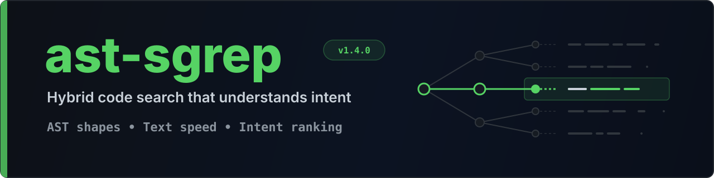

<p align="center">
  
</p>

# ast-sgrep

**Hybrid code search that understands intent** -- not only text or syntax.

**v2.0.0** · 13 languages · local-first semantic · critic + two-channel `AND` · Code Mode (on by default, no API key)

> **ast-grep finds shapes. ripgrep finds strings. ast-sgrep finds intent.**

---

## Install

For Pi, install the native package directly:

```bash
pi install npm:pi-ast-sgrep
```

It immediately adds **`asgrep`** (Code Mode), `asgrep_search`, `asgrep_index`, `asgrep_status`, four `/asgrep-*` commands, and the `ast-sgrep` skill. The first search lazily creates `.asgrep/`; no Rust toolchain, PATH setup, MCP adapter, credential, or runtime download is required. See the [complete Pi package guide](docs/pi-package.md) and [Code Mode](docs/codemode.md).

**Upgrading to 2.0:** this is a breaking semver release. Cloud (`--cloud-embed`, `ASGREP_EMBED_API_KEY`) and Ollama (`--ollama-embed`, `ASGREP_OLLAMA_URL`) embedding clients are gone. Local hashed semantic search remains the default, optional neural embeddings remain in-process, and indexes that still store `embed_backend=cloud|ollama` fail closed until `asgrep reindex`. Pi users can update the package normally.

Standalone CLI binaries are on the [v2.0.0 GitHub Release](https://github.com/AdityaVG13/ast-sgrep/releases/tag/v2.0.0) (`asgrep`, `asgrep_darwin_x64`, `asgrep_linux_arm64`, `asgrep_linux_x64`, `asgrep_windows_amd64.exe`). This release is GitHub + npm only; it is not published to crates.io.

To build from source:

```bash
git clone https://github.com/AdityaVG13/ast-sgrep
cd ast-sgrep
cargo build --release -p ast-sgrep-cli
./target/release/asgrep --help
```

Standalone binaries: `asgrep` and `ast-sgrep` (aliases).

On Unix, the CLI runs commands through the process supervisor. `ASGREP_CPU_LIMIT_PERCENT`
sets the worker process runnable wall-time fraction in each 10 ms SIGSTOP/CONT cycle; it is not
a machine-wide or one-core CPU percentage, and multi-threaded work may consume several cores
while runnable. On Windows, commands run directly: search, indexing, cancellation, and path
handling are supported, but the duty cycle is not enforced.

---


### Agent Plugins (portable skills + MCP)

For non-Pi clients, use the [Agent Plugins](https://agent-plugins.org/) package at [`packages/agent-plugin`](packages/agent-plugin): `plugin.json` + `skills/ast-sgrep` + `mcp.json` (stdio `asgrep-mcp`).

**Code Mode XOR MCP:** Pi → `pi install npm:pi-ast-sgrep` (Code Mode). MCP hosts → `asgrep-mcp` / agent-plugin. Do not register both in the same agent.


## Easy start (agents)

Paste into your agent:

```text
Clone https://github.com/AdityaVG13/ast-sgrep, cd into it, run `cargo build --release -p ast-sgrep-cli`.
Register target/release/asgrep-mcp as a stdio MCP server named "ast-sgrep" (build with: cargo build --release -p ast-sgrep-mcp).
Verify: run ./target/release/asgrep index . then search for defs: of a symbol in this repo.
```

---

## What's new in 2.0

2.0 is the local-first major release. It lands five merged PRs on top of v1.4.0 -- [#27](https://github.com/AdityaVG13/ast-sgrep/pull/27), [#29](https://github.com/AdityaVG13/ast-sgrep/pull/29), [#30](https://github.com/AdityaVG13/ast-sgrep/pull/30), [#31](https://github.com/AdityaVG13/ast-sgrep/pull/31), [#32](https://github.com/AdityaVG13/ast-sgrep/pull/32) -- plus stacked and follow-on commits. Full notes: [CHANGELOG](CHANGELOG.md#v200-2026-08-15).

| You can now... | How |
|----------------|-----|
| Search without a remote embed API | Cloud and Ollama clients are removed. Hashed semantic is default; optional ONNX MiniLM stays in-process (`--features neural-embed`). |
| Compose two indexed channels | `callers:process_request AND pattern:fn $NAME($$$)` joins by overlapping span. Other pairs join by file. `AND NOT` subtracts. Plain English `and` is still hybrid search. |
| See why a hit ranked | A deterministic post-fusion **critic** boosts multi-channel agreement, penalizes identifier-fragment collisions, and writes `critic:` notes into agent JSON `why`. |
| Drill without guessing prefixes | `follow_up_queries` / `suggested_next` are derived from the actual top hit (kind, symbol, missing evidence, margin). Settled hits get an empty list. |
| Overlay SCIP facts | `asgrep index . --scip path/to/index.json` (JSON SCIP only). Missing or malformed input degrades; it never fails the index. Matching graph edges upgrade to `ScipExact`. |
| Trace a directed call path | `asgrep call-path SOURCE SINK .` -- call graph only, not value flow, with resolution-tier evidence. |
| Dry-run an indexed rewrite | `asgrep codemod --pattern 'legacy($ARG)' --rewrite 'modern($ARG)' --dry-run .` then omit `--dry-run` to apply transactionally. |
| Keep Pi results on the model path | One-shot tools and Code Mode put bounded hits in `content`, not only display-only `details`. Native search runs off the Node event loop. |

Also in this release, without changing the day-to-day query prefixes:

- **Index schema 12** with atomic generations, durability profiles, separate code vs prose FTS, and controlled rebuilds for older formats.
- **Ignore rules stay yours.** `.git` and `.asgrep` are the only unconditional directory skips. Dotfiles and user-specific directories are not silently hardcoded.
- **Multi-field semantic vectors** persist beside each chunk; query intent weights those fields. Large repos still use `.asgrep/semantic.ivf`.
- **Repository-learned vocabulary** can widen conceptual candidate discovery (PPMI); final lexical/structural scoring still uses the original query.
- **Watch** bounds freshness under sustained same-path writes and ignores `.asgrep` artifacts before they enter the queue.
- **Native `pattern:`** covers nested structural templates in-process. Optional keep-gates compare `literal:` presence to pinned ripgrep and Pattern-1 to pinned ast-grep when those binaries are provisioned; they do not claim full tool identity.

---

## Why this exists

Most code search is either **fast text** (ripgrep) or **pattern matching** (ast-grep). Neither answers questions like *"where does credential renewal happen?"* when the words in your question do not appear in the code.

**ast-sgrep** builds a **persistent index**: symbols, caller/callee edges, imports, lexical FTS, and **symbol-level semantic vectors** enriched with call-graph context. Query in natural language or with graph prefixes; get ranked hits with excerpts for humans or agents.

**No API key required.** Offline hashed semantic search works out of the box. Optional in-process neural embeddings (ONNX / MiniLM) are a local upgrade, never a network call.

| You need... | ast-sgrep gives you... |
|-------------|------------------------|
| Where is X defined? | `defs:` + ranked hybrid hits |
| Who calls this? | `callers:` + call hierarchy (LSP) |
| How does auth refresh work? | NL → symbols + anchors + semantic similarity |
| "credential renewal" (no token overlap) | Semantic hit on `auth_refresh` |
| Callers of X that match a shape | `callers:X AND pattern:fn $NAME($$$)` |
| Skip test callers | `defs:handle AND NOT callers:test_` |
| Structured JSON for an agent | `--json --format agent` (`why`, `follow_up_queries`) |
| Structural rewrite / codemod | `asgrep codemod` (indexed native patterns) |
| Agent needs search as a tool (not a subprocess) | `asgrep` -- in-process, stateful session (Code Mode) |

[Full comparison →](docs/comparison.md)

---

## Where it fits

ast-sgrep **complements** ripgrep and ast-grep; it does not replace them.

| Tool | Role |
|------|------|
| **[ripgrep](https://github.com/BurntSushi/ripgrep)** | Fast scan of any file. No index. |
| **[ast-grep](https://github.com/ast-grep/ast-grep)** | Structural patterns and full-rule codemods |
| **ast-sgrep** | Persistent navigation + intent: NL, defs/callers/graph, semantic hits, two-channel joins, agent JSON |

On an indexed tree, prefer `literal:` / hybrid search over spawning `rg` for source the index already covers. Keep ripgrep for logs and unindexed files. See [comparison.md](docs/comparison.md).

---

## Quick start

Index is incremental and lives under the project root at `.asgrep/`.

```bash
cargo build --release -p ast-sgrep-cli
./target/release/asgrep index .
./target/release/asgrep 'defs:auth_refresh' . --limit 3
./target/release/asgrep semantic 'credential renewal' . --limit 3
./target/release/asgrep chain 'auth_refresh' . --limit 3
./target/release/asgrep 'callers:process_request AND pattern:fn $NAME($$$)' .
./target/release/asgrep 'defs:handle AND NOT callers:test_' .
./target/release/asgrep call-path main validate_input .
```

Optional overlays and rewrites:

```bash
./target/release/asgrep index . --scip path/to/index.json   # JSON SCIP; degrades, never fails
./target/release/asgrep codemod --pattern 'legacy($ARG)' --rewrite 'modern($ARG)' --dry-run .
```

Unprefixed queries run **hybrid** retrieval. Two-channel `AND` / `AND NOT` is recognized only when both sides are prefixed (`defs:`, `callers:`, `imports:`, `pattern:`, `literal:`, `regex:`, `word:`, or `semantic:`). See the [query grammar](docs/QUERY_GRAMMAR.md).

[Getting started →](docs/getting-started.md) · [Architecture →](docs/ARCHITECTURE.md) · [Docs index →](docs/README.md)

---

## What "semantic" means here

ast-sgrep embeds **symbol chunks** (function/method/type with name, kind, callers, callees, excerpt), expanded with code-domain concept groups (auth ↔ credential ↔ token, refresh ↔ renewal, …). Chunks persist **per-field vectors**; query intent weights those fields instead of concatenating everything into one blob.

```text
Query: "credential renewal"
  → semantic pass ranks auth_refresh (zero token overlap)
```

Provider chain: **neural** (optional `--features neural-embed` + `ASGREP_NEURAL_EMBED`) → **local hashed semantic** (always available). Large repos may use a persisted IVF-ANN sidecar (`.asgrep/semantic.ivf`). There is no cloud or Ollama embed client.

After fusion, the critic reviews the shortlist in-process. Agent envelopes expose `why` (including `critic:` notes) and causal `follow_up_queries`.

[Semantic layer →](docs/semantic-search.md) · [Fusion and critic →](docs/fusion-ranking.md) · [Planner →](docs/cascade-query-planner.md)

---

## Benchmarks (honest summary)

These are **checked-in run summaries**, not portable guarantees. Hardware, corpus, cache state, and flags all matter. Status vocabulary: [benchmarks/README.md](benchmarks/README.md).

| Recorded comparison | Status | Published result | Evidence |
|---------------------|--------|------------------|----------|
| Warm lexical suite vs ripgrep | `historical` / mixed | Strong on recorded cases | [speed.md](benchmarks/results/speed.md) |
| Structural workloads vs ast-grep | `historical` (latency-only, not match-set) | Large speedups in recorded cases | [speed.md](benchmarks/results/speed.md) |
| Cross-tool bake-off | `UNREPRODUCIBLE` | Mixed; inspect every row | [bakeoff.md](benchmarks/results/bakeoff.md) |
| Known regressions | `UNREPRODUCIBLE` | Published without suppression | [losses.md](benchmarks/results/losses.md) |
| 2026-08-05 release run (self corpus) | `reproducible-in-tree` | Structural pattern 31× faster on the quality path; literal ≈ ripgrep; cold index 906 ms p95 | [speed.md](benchmarks/results/speed.md) |

Measured 2026-08-05 on the self corpus (1,107 tracked files) on the **integrated release/1.4.0 tree**: cold index **2.3 s p95** with semantic embedding (budget breach on the grown corpus -- the 285 ms budget was set for 110 files; SHA unrecorded; the original 88.5 s pr21 build was fixed by capping child chunks, `0ba34da`), warm literal **19.5 ms** (≈ ripgrep 15.7 ms), structural pattern **33.1 ms** with the quality batch vs **987 ms** without (ast-grep: 24.2 ms), semantic NL **19.6 ms**. Full provenance in [speed.md](benchmarks/results/speed.md). 2.0 did not republish that suite; do not treat those rows as a 2.0 fingerprint.

Canonical table: [head-to-head.md](benchmarks/results/head-to-head.md). Index: [benchmarks/README.md](benchmarks/README.md).

**Quality snapshot (UNREPRODUCIBLE):** cite only fingerprint `self-hybrid-d3eab74` in [baselines.md](benchmarks/results/baselines.md#retrieval-quality--self-corpus-18-gold-queries) -- hybrid MRR **0.712**, Recall@k **0.889**, nDCG@k **0.751**. The gold harness is absent. Do not quote the superseded ≈0.75 / 0.94 row (`self-hist-pre-29129bd`) as current. On some foreign corpora the offline embedder currently adds little over lexical + AST.

---

## Interfaces

| Interface | Build | Use case |
|-----------|-------|----------|
| **CLI** | `cargo build --release -p ast-sgrep-cli` | Terminal, scripts, `call-path`, `codemod` |
| **MCP** | `cargo build --release -p ast-sgrep-mcp` | AI agents (stdio); `structuredContent` / `outputSchema` |
| **Code Mode** | `ast-sgrep-codemode` | Programmatic tool-calling / multi-step plans (Pi) |
| **LSP** | `cargo build --release -p ast-sgrep-lsp` | Editor navigation |
| **Library** | `ast-sgrep-core` | Embed search in Rust tools |
| **JSON plugins** | `--format agent\|github\|gitlab\|agent-capsule` | Agents / CI |

---

## Documentation

| Doc | Contents |
|-----|----------|
| [docs/README.md](docs/README.md) | Full documentation index |
| [Getting started](docs/getting-started.md) | Install, index, queries, flags |
| [Pi package guide](docs/pi-package.md) | Pi install, tools, data, security, updates, rollback, uninstall |
| [Architecture](docs/ARCHITECTURE.md) | Index schema, search pipeline, crates |
| [Query grammar](docs/QUERY_GRAMMAR.md) | Prefixes, two-channel `AND` / `AND NOT` |
| [Semantic search](docs/semantic-search.md) | Chunks, providers, IVF-ANN |
| [Fusion ranking](docs/fusion-ranking.md) | RRF, post-fusion critic, `why` |
| [Cascade planner](docs/cascade-query-planner.md) | Retrieval cascade and causal follow-ups |
| [Benchmarks](benchmarks/README.md) | Methodology, reproduction, losses |
| [Comparison](docs/comparison.md) | vs ripgrep / ast-grep |
| [MCP](docs/mcp.md) · [Code Mode](docs/codemode.md) · [Use cases](docs/use-cases.md) · [Releasing](docs/RELEASING.md) | Agents, PTC, LSP, release checklist |

---

## Workspace layout

| Path | Role |
|------|------|
| `crates/ast-sgrep-core` | Index, SQLite store, hybrid search, critic, planner |
| `crates/ast-sgrep-cli` | `asgrep` / `ast-sgrep` CLI + supervisor |
| `crates/ast-sgrep-lang` | Tree-sitter extraction (13 languages) |
| `crates/ast-sgrep-embed` | In-process embedding backends + optional rerank |
| `crates/ast-sgrep-mmap` | Memory-map helpers |
| `crates/ast-sgrep-lsp` | Language server |
| `crates/ast-sgrep-mcp` | MCP server |
| `crates/ast-sgrep-codemode` | Code Mode / programmatic tool-calling |
| `crates/ast-sgrep-plugins` | Output formats |
| `packages/pi/` | Pi extension, launcher, and native packages |
| `packages/agent-plugin/` | Portable Agent Plugins + MCP |
| `benchmarks/` | Published results (`results/`) and studies (`studies/`) |
| `docs/` | User and architecture docs |

---

## Project status and verification

**v2.0.0.** Local-first embeddings, index schema 12, two-channel conjunction, post-fusion critic, causal follow-ups, SCIP overlay, `call-path`, indexed `codemod`, and Pi Code Mode (results on the model path) are in place. 13 languages, fusion-normalized ranking, and the hashed semantic layer remain.

GitHub Actions workflows are **manual-only** (`workflow_dispatch`) to control Actions minutes. Local quality bar for contributors:

```bash
cargo check --workspace --lib --bins -j1
cargo build --release -p ast-sgrep-cli -j1
./target/release/asgrep --help
```

See [CONTRIBUTING.md](CONTRIBUTING.md).

---

## License

MIT. See [LICENSE](LICENSE).