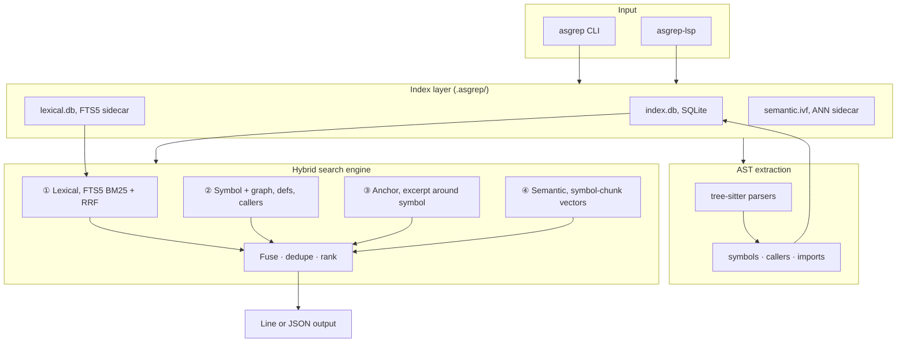
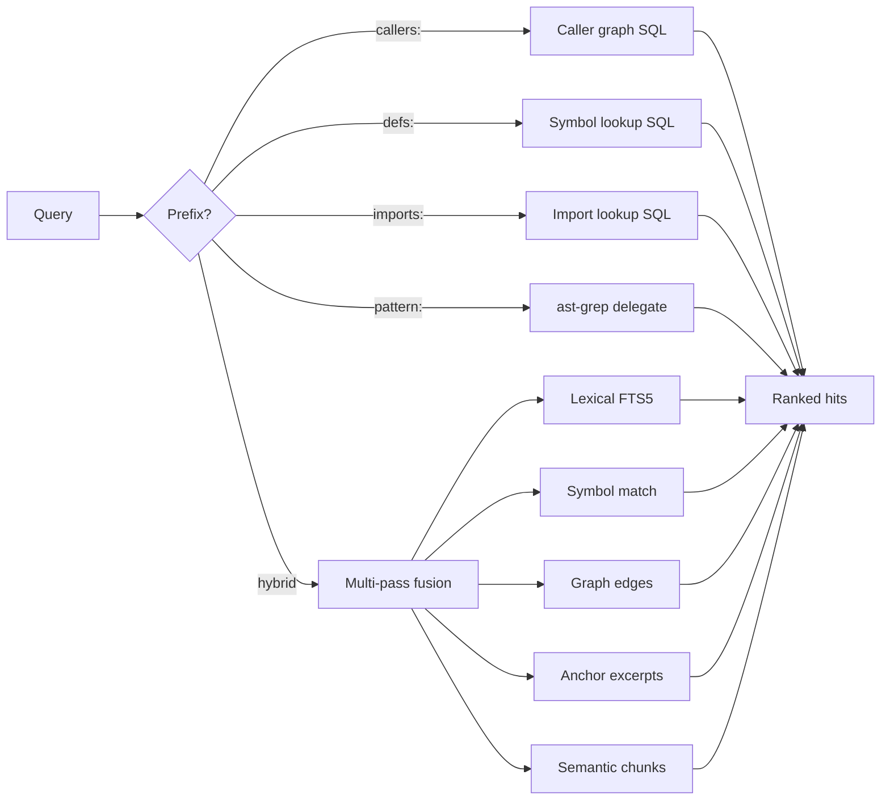

# How it works

ast-sgrep is a **persistent hybrid search engine** over a polyglot AST index. This document covers architecture, the search pipeline, on-disk layout, and incremental indexing.

## High-level architecture



### Crate layout

```
ast-sgrep/
├── crates/ast-sgrep-core/    # Index + hybrid search engine
├── crates/ast-sgrep-cli/     # asgrep / ast-sgrep binaries
├── crates/ast-sgrep-lang/    # tree-sitter parsers (8 languages)
├── crates/ast-sgrep-embed/   # Semantic local + Ollama + cloud
├── crates/ast-sgrep-plugins/ # GitHub / GitLab / agent JSON
├── crates/ast-sgrep-lsp/     # asgrep-lsp
└── tests/fixtures/           # Polyglot sample + regression fixtures
```

| Crate | Role |
|-------|------|
| `ast-sgrep-lang` | Language detection, tree-sitter parsing, symbol/caller extraction |
| `ast-sgrep-core` | SQLite store, hybrid search passes, ranking, IVF-ANN |
| `ast-sgrep-embed` | Embedding provider chain and semantic local model |
| `ast-sgrep-cli` | User-facing CLI |
| `ast-sgrep-lsp` | Language Server Protocol |
| `ast-sgrep-plugins` | Output format adapters |

## Search pipeline



### Query routing

1. **Prefixed queries** bypass hybrid fusion and hit dedicated SQL or external tools:
   - `callers:`, `defs:`, `imports:` → graph/symbol tables
   - `pattern:` → ast-grep subprocess (when installed)

2. **Hybrid queries** (no prefix) run multiple passes in parallel conceptually, then fuse:
   - **Lexical**, FTS5 BM25 on `lines_fts` (and optional Tantivy sidecar at scale)
   - **Symbol**, name/kind match on `symbols`
   - **Graph**, caller/callee neighborhood for matched symbols
   - **Anchor**, line-bounded excerpts around symbol definitions
   - **Semantic**, cosine similarity over `semantic_chunks` (or IVF-ANN above threshold)

3. **Ranking**, scores are fused, deduplicated by file+symbol+kind, and truncated to `--limit`.

Reciprocal rank fusion (RRF) is used where multiple ordered lists contribute to the same hit.

## Index schema (`.asgrep/index.db`)

| Table | Contents |
|-------|----------|
| `files` | Path, language, content hash, mtime |
| `lines` | Per-line text content |
| `lines_fts` | FTS5 virtual table for lexical search |
| `symbols` | Function/method/type definitions (name, kind, spans) |
| `callers` | Caller → callee edges (AST-derived, string/comment-safe) |
| `imports` | Import/module paths |
| `semantic_chunks` | Symbol-level vectors with call-graph context |
| `embeddings` | Legacy per-line vectors (pre-symbol-chunk indexes) |

Metadata (SQLite `meta` table) stores embed backend, dimension, and index fingerprint for sidecar invalidation.

### Sidecars

| File | When | Purpose |
|------|------|---------|
| `.asgrep/lexical.db` | 1000+ files or `--tantivy` | Dedicated FTS5 / Tantivy lexical index |
| `.asgrep/semantic.ivf` | ≥ `ann_threshold` symbols | Persisted IVF clusters + vectors; fingerprint-invalidated on reindex |

Below the ANN threshold, semantic search uses brute-force cosine over all symbol vectors (sub-millisecond for typical repos).

## Indexing flow

1. **Walk** project tree (respect `.gitignore`, `.asgrepignore`)
2. **Detect language** from extension / shebang
3. **Parse** with tree-sitter (C# uses regex fallback)
4. **Extract** symbols, caller edges, imports
5. **Build semantic chunks** per symbol (name, kind, callers, callees, excerpt) → embed → `semantic_chunks`
6. **Upsert** file row, lines, symbols, graph edges; remove stale rows for changed files
7. **Build IVF sidecar** if symbol count exceeds threshold

Incremental skip: if `content_hash` and mtime match, file is not re-parsed.

## Caller graph safety

Caller edges are extracted from AST call expressions, not naive substring match. This avoids false positives like matching `auth_refresh` inside a string literal or comment. Regression tests enforce 0% false caller rate on fixtures.

## Library usage

```rust
use ast_sgrep_core::{IndexOptions, Indexer, SearchOptions, Searcher};

let mut indexer = Indexer::new(IndexOptions {
    root: ".".into(),
    index_path: None,
    lang_filter: None,
    respect_gitignore: true,
    use_tantivy: false,
    embed_semantic: true,
    embed_backend: ast_sgrep_core::EmbedBackend::Auto,
    force_reindex: false,
})?;
indexer.index_all()?;

let searcher = Searcher::new(SearchOptions {
    root: ".".into(),
    index_path: None,
    limit: 16,
    lang_filter: None,
    use_embed: true,
    use_tantivy: false,
    use_cloud_embed: false,
    use_ollama_embed: false,
    use_semantic_only: false,
    ann_threshold: None,
})?;
let response = searcher.search("auth refresh")?;
```

Plugin formatting:

```rust
use ast_sgrep_plugins::{format_response, OutputFormat};

let agent = format_response(&response, OutputFormat::Agent);
```

## Supported languages

Rust, TypeScript, JavaScript, Python, Go, Java, C#, Ruby, unified index, single query surface.

Adding a language (contributors): tree-sitter grammar in `ast-sgrep-lang`, implement `LanguageParser`, register in `ParserRegistry`, map extensions in `detect_language()`.

## Related docs

- [Semantic search](semantic-search.md), symbol chunks, providers, IVF tuning
- [Getting started](getting-started.md), CLI commands and flags
- [Use cases](use-cases.md), LSP and agent integration
