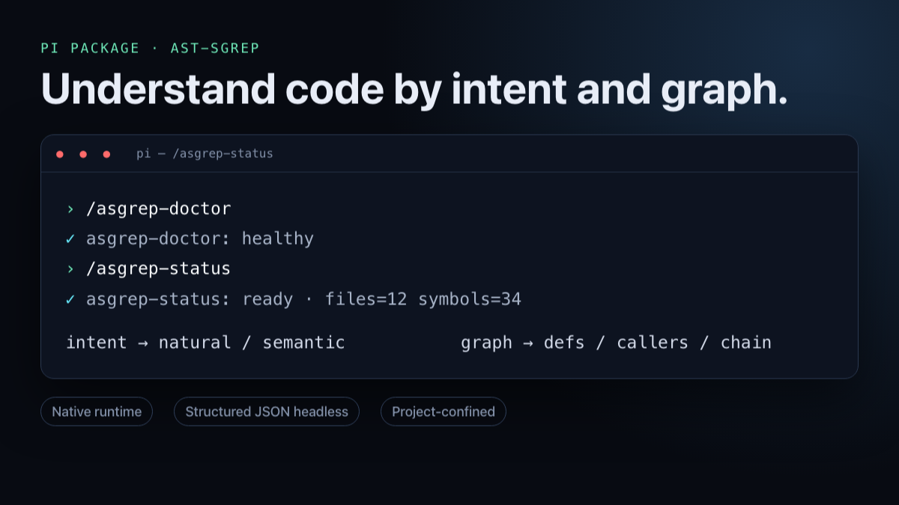

# pi-ast-sgrep

[](https://github.com/AdityaVG13/ast-sgrep/blob/main/docs/pi-package.md)

Native intent, structural, definition, caller, chain, and semantic code search for Pi.

```bash
pi install npm:pi-ast-sgrep
```

Requires Node.js `>=22.19.0`, Pi `>=0.80.6 <1`, and a packaged host: macOS arm64/x64, glibc Linux arm64/x64, or Windows x64. The extension, `ast-sgrep` launcher, and selected native package manifests are exact-version matched at `1.2.0-alpha`; the embedded CLI compatibility identity is `1.2.0-alpha`. Alpine/musl, Windows arm64, and other hosts fail with an actionable unsupported-platform error; there is no source build or runtime download fallback.

## First use

The package registers:

- `asgrep_search`, `asgrep_index`, and `asgrep_status` tools;
- `/asgrep-doctor`, `/asgrep-status`, `/asgrep-index`, and `/asgrep-reindex` commands;
- the `ast-sgrep` skill.

Open Pi in a project and search. The first search lazily creates `.asgrep/`. Examples for `asgrep_search`:

```json
{"query":"auth_refresh","mode":"defs"}
{"query":"auth_refresh","mode":"callers"}
{"query":"where are credentials renewed?","mode":"semantic"}
```

Run `/asgrep-doctor` to diagnose the runtime, binary, protocol, index, or configuration; run `/asgrep-status` to inspect the current project. The extension refreshes successful Pi write/edit changes before the next search and coalesces concurrent refreshes.

## Local by default

Local semantic indexing/search works offline with no credential, telemetry, first-use model download, executable download, PATH lookup, or MCP adapter. Optional external embedding providers are opt-in and may receive the source text and queries needed to create embeddings.

Indexing writes database, embedding, metadata, and lock/rebuild files under the project's `.asgrep/`. The package never edits `.gitignore`; add `.asgrep/` yourself if you do not want it committed. Pi packages run with the OS user's full access and are not sandboxed.

## Update or remove

```bash
pi update npm:pi-ast-sgrep
pi remove npm:pi-ast-sgrep
```

Removal preserves every project's `.asgrep` data for reinstall or rollback. Delete that directory separately and explicitly only when you no longer need it. Compatible updates reuse validated data; incompatible formats rebuild atomically and preserve recoverable prior data on failure. Roll back by removing the package and installing `npm:pi-ast-sgrep@<previous-version>`, then run `/asgrep-doctor`.

Read the [complete install, configuration, security, recovery, and uninstall guide](https://github.com/AdityaVG13/ast-sgrep/blob/main/docs/pi-package.md). Release provenance and package order are documented in [RELEASING.md](https://github.com/AdityaVG13/ast-sgrep/blob/main/docs/RELEASING.md).

MIT
